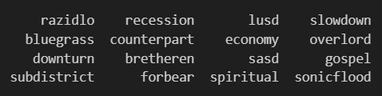
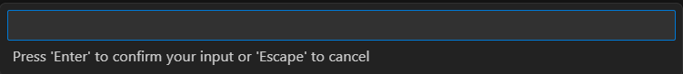
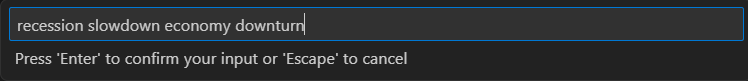
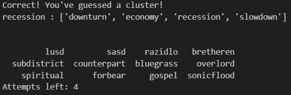
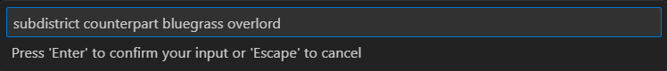
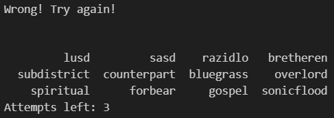
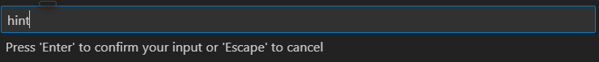
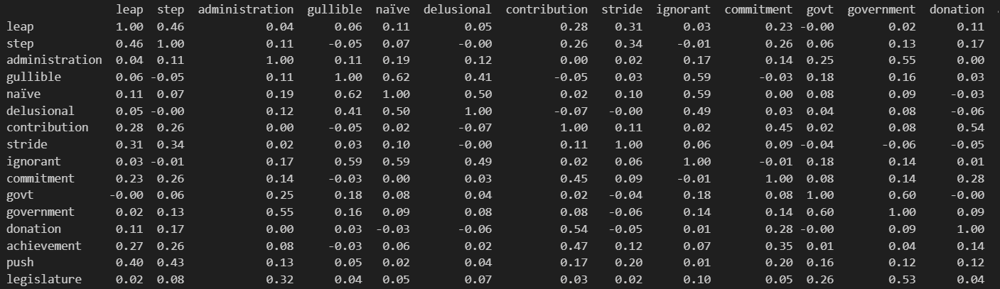

# *NYT Connections* generator
A project made in Python which uses skills learned while taking this course: [link](https://www.mathos.unios.hr/en/kolegiji/racunalno-jezikoslovlje/). Using libraries `nltk` and `gensim`, it uses `gensim`'s Word2Vec model to make an instance of a single *NTY Connections* "game".

## What this repository contains?
  - Python notebook in Croatian which examines what the project is about and how it works

## What will be added to this repository?
  - Python notebook in English which examines what the project is about and how it works
  - A video in Croatian going about it in more detail
  - A single Python script which will work as a single program

## Requirements
  - `jupyterlab` installed, in case it is needed to open .ipynb files
  - `nltk`, `gensim` and `pandas` libraries are not required, but it would be beneficiary to have them preinstalled
  - [Google Word2Vec model](https://code.google.com/archive/p/word2vec/) installed, not a requirement but it would save a lot of time

Libraries can be downloaded using `pip install jupyterlab nltk gensim pandas` (use only the library names you need to install) in your command prompt.

## How to play?

### First game in a kernel/enviorment
When opening projekt.ipynb file, use the global enviorment or make a virtual one as a kernel. Then, just hit `run all` button or run cell by cell in that order. It's possible you'll need to wait some time to get libraries installed and it can take up to 20 minutes to download the pretrained Word2Vec model on your computer (model size: 1.5 GB)

### Other games in the same kernel/enviorment
If this is the case, you can just run the last two cells. If for some reason it throws you an error, just click `run all` button again.

### General playing
When second-to-last cell is finished running, a table of 16 words will appear like this

Then, a box for input will pop up like this.

You need to type out your guess of 4 words into it, divided by space. Here is an example when a correct attempt it made:

And here is an example for when an incorrect attempt is made:

You can also type in `hint`, which will output a similarity matrix between the words still left in the table.

You have 4 attempts, each attempt is reduced if you guess wrong. If your guess is correct, no attempt is subtracted.

In the end there will be a `GAME OVER!` message, with the appropriate message depending on wether you won or lost the game. Then, correct groups will be printed in the order of thoughness (in the order they were generated) and how many hints you've used in the game

## Literature
  - [nltk](https://www.nltk.org/)
  - [gensim](https://radimrehurek.com/gensim/)
  - [pandas](https://pandas.pydata.org/docs/reference/index.html)
  - [Google Word2Vec model](https://code.google.com/archive/p/word2vec/)
  - liteture put in the literature folder in this repository
